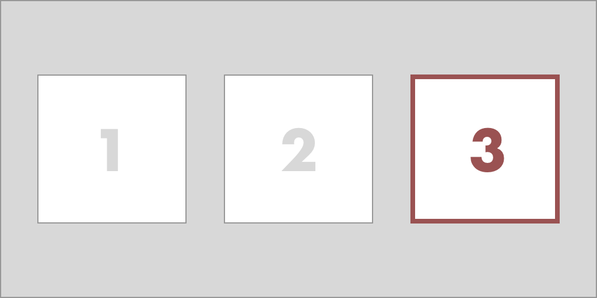
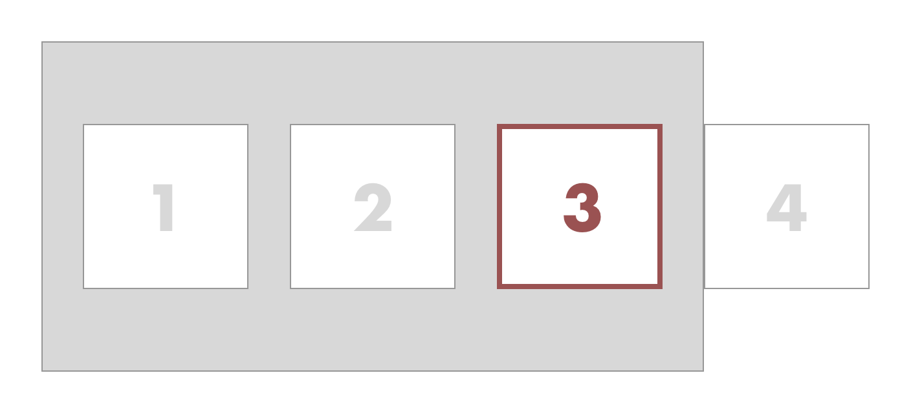
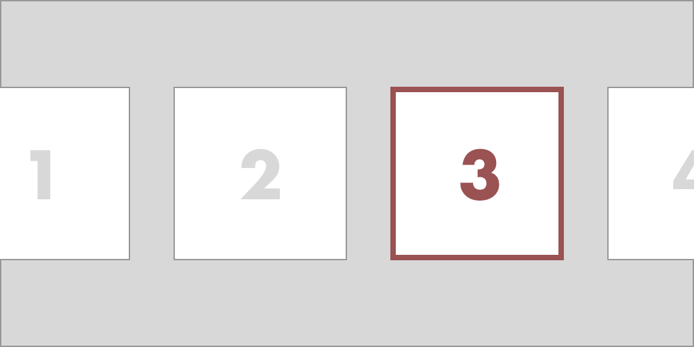

# dpad-compose
D-pad navigation in Jetpack Compose


## The problem
While Android is mostly used on touch devices, the operating system can also be used with arrow keys and d-pads (directional pads).
At the time of writing, the new UI toolkit for writing native Android apps, [Jetpack Compose](https://developer.android.com/jetpack/compose), only has partial support for such navigation in its latest stable release `1.2.0`.
The library supports focus and click handling using the `clickable()` [modifier](https://developer.android.com/reference/kotlin/androidx/compose/ui/Modifier) to move focus between items based on directional key presses, but there are usability issues with the out-of-the-box behavior:

### No scroll padding
When moving focus to an element that is at the edge of the screen in a scrollable container, the focused element is brought visible without any padding or offset.
The consequence is that there is no indication to the user that there might be more elements accessible by scrolling further.

Consider a row consisting of four focusable boxes on a row, but where only three boxes fit in the viewport.
When focusing the third item, the viewport will look as following for the user:



In other words, there is no indication to the user hinting that there is a fourth item as well:



A more desirable behavior would be that a part of the next focusable item is visible already when focusing the third element:



### No way to cancel clicks
When tapping a button, clicks can be canceled by dragging the finger out from the element before releasing the touch.
Similar behavior could be expected from a button that is clicked using the enter key, if a directional key is pressed before releasing the enter key the click could be canceled.
Out of the box, with the `.clickable()` modifier, this is no the case however.
The click handler of the newly focused element will be called instead.

### Tutorial goal
The goal of this tutorial is to explain how the aforementioned usability issues can be addressed by implementing a custom `.dpadFocusable()` modifier.

Feel free to suggest improvements by creating an issue or a pull request.

## TL;DR
- [ScrollableGrid.kt](app/src/main/java/dev/berggren/ScrollableGrid.kt)
- [DpadFocusable.kt](app/src/main/java/dev/berggren/DpadFocusable.kt)
- [MainActivity.kt](app/src/main/java/dev/berggren/MainActivity.kt)

## Tutorial

First, we'll create a grid with colored boxes that expand beyond the screen both vertically and horizontally.
Each row is individually scrollable horizontally while the whole grid can be scrolled vertically.
Think Netflix and TV series.


First, we need a main `Column` that positions its children vertically that is scrollable:

```kotlin
Column(
    Modifier
        .fillMaxSize()
        .verticalScroll(verticalScrollState)
) { /* Children here */ }
```

Secondly, for each row we add a `Row` that positions its children horizontally and that's also scrollable:

```kotlin
val rowScrollState = remember { ScrollState(initial = 0) }
Row(
    Modifier
        .fillMaxWidth()
        .padding(bottom = 24.dp)
        .horizontalScroll(rowScrollState)
) { /* Row content here */ }
```

Finally, we need to compose the row items.
To make our solution generic we put our existing code inside a component that allows us to pass generic items `T`.
These items are passed as a list of lists, a list of row items, of any type `T`.
In addition to this, we pass a function that maps any item `T` to a composable, i.e. what that item should look like.
Using this component we can create scrollable grids of this kind with any type of items:

```kotlin
import androidx.compose.foundation.*
import androidx.compose.foundation.layout.*
import androidx.compose.runtime.*
import androidx.compose.ui.Modifier
import androidx.compose.ui.unit.dp

@Composable
fun <T> ScrollableGrid(
    items: List<List<T>>,
    contentForItem: @Composable BoxScope.(item: T, position: GridPosition) -> Unit
) {
    val verticalScrollState = remember { ScrollState(initial = 0) }

    Column(
        Modifier
            .fillMaxSize()
            .verticalScroll(verticalScrollState)
    ) {
        items.forEachIndexed { rowIndex, rowItems ->
            val rowScrollState = remember { ScrollState(initial = 0) }
            Row(
                Modifier
                    .fillMaxWidth()
                    .padding(bottom = 24.dp)
                    .horizontalScroll(rowScrollState)
            ) {
                rowItems.forEachIndexed { columnIndex, rowItem ->
                    Box(Modifier.padding(horizontal = 12.dp)) {
                        contentForItem(
                            rowItem,
                            GridPosition(
                                rowIndex = rowIndex,
                                columnIndex = columnIndex
                            )
                        )
                    }
                }
            }
        }
    }
}

@Stable
data class GridPosition(val rowIndex: Int, val columnIndex: Int)
```
[ScrollableGrid.kt](app/src/main/java/dev/berggren/ScrollableGrid.kt)

Next, we'll use our newly created component to create a grid of colored boxes.
First, let's prepare list of lists containing the colors we want to display.
To make this look decent I picked a palette from [flatuicolors.com](https://flatuicolors.com/palette/defo) and copied some of the colors to a list:

```kotlin
val rowColors = listOf(
    Color(0xff1abc9c),
    Color(0xff2ecc71),
    Color(0xff3498db),
    Color(0xff9b59b6),
    Color(0xff34495e)
)
```

These are the primary colors for each row, but to further distinguish them horizontally let's darkened them progressively:

```kotlin
val itemsPerRow = 10
val boxColors = rowColors.map { rowColor ->
    (0..itemsPerRow).map { rowIndex ->
        val fraction = (1 - rowIndex.toFloat() / itemsPerRow)
        Color(
            red = fraction * rowColor.red,
            green = fraction * rowColor.green,
            blue = fraction * rowColor.blue
        )
    }
}
```

Next, let's add component that represent a grid item.
In this case the item is a rectangular box with the given color as background:

```kotlin
@Composable
fun ColoredBox(
    modifier: Modifier = Modifier,
    color: Color
) {
    Box(
        modifier
            .size(128.dp)
            .background(color)
    )
}
```

Finally, let's pass the colors to the scrollable grid and the colored box component:

```kotlin
MaterialTheme {
  Column(
    Modifier
      .fillMaxSize()
      .background(Color(0xffecf0f1))
      .padding(top = 24.dp)
  ) {
    ScrollableGrid(
      items = boxColors,
    ) { color, _ ->
      ColoredBox(
        color = color
      )
    }
  }
}
```

At this stage, you should have a Netflix-like grid that is row-wise scrollable and vertically scrollable as a whole.

### Focus and click handling
The next step is to make the grid items focusable using the d-pad and to invoke click actions when clicking the center key or enter.
Similar to how adding out-of-the-box click and focus handling is done using the `clickable()` modifier, we'll create a custom modifier `dpadFocusable()` that we can attach to grid items.
This modifier has the responsibility of showing a border if focused and appropriately responding to key events.


First, let's add a dummy modifier and add some arguments for configuring its behavior:

```kotlin
@OptIn(ExperimentalFoundationApi::class)
@ExperimentalComposeUiApi
fun Modifier.dpadFocusable(
    onClick: () -> Unit,
    borderWidth: Dp = 4.dp,
    unfocusedBorderColor: Color = Color(0x00f39c12),
    focusedBorderColor: Color = Color(0xfff39c12),
    indication: Indication? = null,
    visibilityPadding: Rect = Rect.Zero,
    isDefault: Boolean = false

) = composed { /* Content here */ }
```

Next, we need a way to visualize what item is currently focused.
In this case, we use a border that smoothly transitions between the focused color and the unfocused color (the default argument is in this case the focused color with alpha 0):

```kotlin
... = compose {
  val boxInteractionSource = remember { MutableInteractionSource() }
  val isItemFocused by boxInteractionSource.collectIsFocusedAsState()
  val animatedBorderColor by animateColorAsState(
      targetValue =
      if (isItemFocused) focusedBorderColor
      else unfocusedBorderColor
  )

  this.
    border(
      width = borderWidth,
      color = animatedBorderColor
    )
}
```

In addition to visualization whether an element is focused, we also want to visualize whether it is clicked or not.
This can be done by using the `.indication()` modifier.
In case the user did not specify a particular indication, we fall back to the default ripple indication:

```kotlin
... = compose {
  /* [...] */
  this.
    /* [...] */
    .indication(
      interactionSource = boxInteractionSource,
      indication = indication ?: rememberRipple()
    )
}
```

In the last steps, we used an interaction source (`boxInteractionSource`) to listen to whether the item is focused or not.
To receive use events, we need to emit them whenever the box gains or releases focus.
Normally, `boxInteractionSource` could simply have been passed to the clickable modifier and it would have emitted the events for us.
As we want to override the default behavior, however, we have to emit these events ourselves. 
When we gain focus, we emit a focus event and store it as a state variable.
When focus is lost, we emit an unfocus event that refers to the last focus event:

```kotlin
... = compose {
  /* [...] */
  var previousFocus: FocusInteraction.Focus? by remember {
      mutableStateOf(null)
  }
  this.
    /* [...] */
    .onFocusChanged { focusState ->
        if (focusState.isFocused) {
            val newFocusInteraction = FocusInteraction.Focus()
            scope.launch {
                boxInteractionSource.emit(newFocusInteraction)
            }
            previousFocus = newFocusInteraction
        } else {
            previousFocus?.let {
                scope.launch {
                    boxInteractionSource.emit(FocusInteraction.Unfocus(it))
                }
            }
        }
    }
    .focusTarget()
```

Now the items will have a border whenever they are focused.
Next, we'll add clicking.

There are two main goals when handling key events: invoke the on-click handler whenever the center key is pressed and visualizing press and release events.
For good user experience, we need to make it possible to cancel click events too.
This is done by pressing and holding the center key (or enter) and then navigating to another item before releasing the center key (similar to how a tap can be canceled by dragging the finger away from the touched element before releasing).

We add a `.keyEvent()` modifier with a block that is run for key events, but we ignore any other key than the center or enter key by returning early:

```kotlin
/* [...] */
this.
/* [...] */
  .onKeyEvent {
    if (!listOf(Key.DirectionCenter, Key.Enter).contains(it.key)) {
      return@onKeyEvent false
    }
  /* [...] */
  }
```

Then we check whether the event was a key down or key up event.
For key down events, we don't invoke the click handler yet, but we want to indicate to the user that the click has been registered.
This is done by emitting a [PressInteraction.Press](https://developer.android.com/reference/kotlin/androidx/compose/foundation/interaction/PressInteraction) event to the interaction source:

```kotlin
... = compose {
  val scope = rememberCoroutineScope()
  this.
  /* [...] */
    .onKeyEvent {
    /* [...] */
      when (it.type) {
        KeyEventType.KeyDown -> {
          val press =
            PressInteraction.Press(
              pressPosition = Offset(
                x = boxSize.width / 2f,
                y = boxSize.height / 2f
              )
            )
          scope.launch {
            boxInteractionSource.emit(press)
          }
          previousPress = press
          true
        }
        KeyEventType.KeyUp -> { /* [...] */ }
        else -> false
      }
    }
}
```

In the snippet above, there are two variables that we haven't declared yet: `boxSize` and `previousPress`.

The default indication, ripple indications, grows from the point where the user pressed the item.
For this reason we need to specify a position for the interaction, even though a d-pad click has no inherent position.
One option that I found to look good is to have the ripple grow from the center of the item.
To achieve this we need to know the width and height of the element in question.
This can be done by adding a [onSizeChanged](https://developer.android.com/reference/kotlin/androidx/compose/ui/layout/OnSizeChangedModifier) modifier that is called whenever the element's global position changes.
We keep track of the size and update it whenever the modifier's block is called:

```kotlin
... = compose {
  /* [...] */
  var boxSize by remember {
    mutableStateOf(IntSize(0, 0))
  }
  this.
    /* [...] */
    .onSizeChanged {
        boxSize = it
    }
}
```

After the ripple indication has finished the background of the pressed item remains slightly dimmed to indicate that it is still being pressed.
To release the dimming we need to emit a `PressInteraction.Release` event with the press event as an argument (this has to be specified for supporting pressing the same item multiple times at different positions), which was the reason why we saved the press event in a variable in the previous snippet.
Now let's actually declare the variable and use it to release the press on key ups.
We also invoke the click handler here:

```kotlin
... = compose {
  /* [...] */
  var previousPress: PressInteraction.Press? by remember {
    mutableStateOf(null)
  }
  this.
    /* [...] */
    .onKeyEvent {
      /* [...] */
      when (it.type) {
        /* [...] */
        KeyEventType.KeyUp -> {
          previousPress?.let { previousPress ->
            onClick()
            scope.launch {
              boxInteractionSource.emit(
                PressInteraction.Release(
                  press = previousPress
                )
              )
            }
          }
          true
        }
      }
    }
}
```

As the `.onKeyEvent` is only called if the item is focused, clicks can be canceled by navigating to another item and hence unfocusing the item before releasing the center key.
This also means, however, that the item will remain in a pressed state.
To ensure the presses are released whenever the item is unfocused, we add [LaunchedEffect](https://developer.android.com/jetpack/compose/side-effects#launchedeffect) that is run every time the `isItemFocused` state changes.
We use this to release any potentially present press whenever the item is unfocused:

```kotlin
... = compose {
  /* [...] */
  LaunchedEffect(isItemFocused) {
    previousPress?.let {
      if (!isItemFocused) {
        boxInteractionSource.emit(
          PressInteraction.Release(
            press = it
          )
        )
      }
    }
  }
```

With all these parts, we end up with a box that can capture focus and handle clicks:


## Reacting to click events in the grid
With a scrollable grid and a modifier for reacting to click events, let's put the two parts together to react to clicks on items in the grid.

First, we'll create a banner component with a text and a circle indicating for visualizing what color has been clicked last:

```kotlin
@Composable
fun ColorClickedBanner(color: Color) {
  Row {
    Row(Modifier.height(IntrinsicSize.Min)) {
      Text(text = "Clicked color: ", style = MaterialTheme.typography.h3)
      Spacer(Modifier.width(24.dp))
      Box(
        Modifier
          .background(color, CircleShape)
          .aspectRatio(1f)
          .fillMaxSize()
      )
    }
  }
}
```

We then place the banner above the grid and add some state for keeping track of what color has been clicked.
We update this state by adding our newly created `.dpadFocusable` modifier to the colored box item:

```kotlin
var colorClicked: Color by remember { mutableStateOf(Color.Transparent) }

MaterialTheme {
  Column(
    Modifier
      .fillMaxSize()
      .background(Color(0xffecf0f1))
      .padding(top = 24.dp)
  ) {
    ColorClickedBanner(color = colorClicked)
    Spacer(Modifier.height(24.dp))
    ScrollableGrid(
      items = boxColors,
    ) { color ->
      ColoredBox(
          Modifier.dpadFocusable(
            onClick = {
              colorClicked = color
            }
          ),
          color = color
      )
    }
  }
}
```
[MainActivity.kt](app/src/main/java/dev/berggren/MainActivity.kt)

Voilà!
We now have a grid that is scrollable, where items can be navigated using the d-pad, and where center clicks cause and indication and the banner to update based on the item clicked.


### Scroll padding
Items outside of the scroll viewport are currently visible, but there is nothing that guarantees that the next item is exposed to hint the user that there are more elements in the list.
In this part of the tutorial, we will use the `BringIntoViewRequester()` modifier to achieve this behavior.

`BringIntoViewRequester()` can be used to request an item to be made visible.
When called, the parent scroll containers will scroll to ensure that it is made visible.
It also supports passing a rectangle that specifies exactly what local coordinates should be made visible.
We will use this to add "scroll padding" and expose parts of the next item.

First, we will create a `BringIntoViewRequester()` and attach it to the item:

```kotlin
... = compose {
  /* [...] */
  val bringIntoViewRequester = remember { BringIntoViewRequester() }

  this
    .bringIntoViewRequester(bringIntoViewRequester)
    /* [...] */
```

Then, whenever we gain focus, we'll call the bring into view requester with the user-passed padding added:

```kotlin
fun Modifier.dpadFocusable(
  /* [...] */
  visibilityPadding: Rect = Rect.Zero,
  /* [...] */
) = composed {
  this
    .onFocusChanged { focusState ->
        if (focusState.isFocused) {
            /* [...] */
            scope.launch {
                val visibilityBounds = Rect(
                    left = -1f * visibilityPadding.left,
                    top = -1f * visibilityPadding.top,
                    right = boxSize.width + visibilityPadding.right,
                    bottom = boxSize.height + visibilityPadding.bottom
                )
                bringIntoViewRequester.bringIntoView(visibilityBounds)
            }
            /* [...] */
        } else {
          /* [...] */
        }
    }
```

Finally, we'll pass a visibility padding that corresponds to the spacing between the boxes and half of a box width.
Before passing this value, we also need to convert it from density pixels to on-screen pixels:

```kotlin
/* [...] */
ScrollableGrid(
    items = boxColors
) { color, position ->
    val elementPaddingAndHalfOfNextBox = with(LocalDensity.current) {
        (boxPadding + boxSize.div(2)).toPx()
    }
    ColoredBox(
        Modifier.dpadFocusable(
            /* [...] */
            visibilityPadding = Rect(
                left = elementPaddingAndHalfOfNextBox,
                top = elementPaddingAndHalfOfNextBox,
                right = elementPaddingAndHalfOfNextBox,
                bottom = elementPaddingAndHalfOfNextBox
            ),
            /* [...] */
        ),
        /* [...] */
    )
}
```

Now when scrolling towards the edge of the viewport, half of the next element is exposed.

TODO: Add a video of this.

### Supporting touch
As we aren't using the `.clickable()` modifier, we have lost support for tapping the element using touch.
In an Android TV environment that is purely d-pad based, this may not matter much.
But on other environments that support both modes this is essential.

We'll add support for touch by listening to whether we're in keyboard or touch mode.
Whenever we're in touch mode, we'll simply attach a `.clickable()` modifier and let it handle touch events for us:

```kotlin
... = compose {
  /* [...] */
  val inputMode = LocalInputModeManager.current

  if (inputMode.inputMode == InputMode.Touch)
      this.clickable(
          interactionSource = boxInteractionSource,
          indication = indication ?: rememberRipple()
      ) {
          onClick()
      }
  } else {
    /* D-pad modifier code */
  }
```
